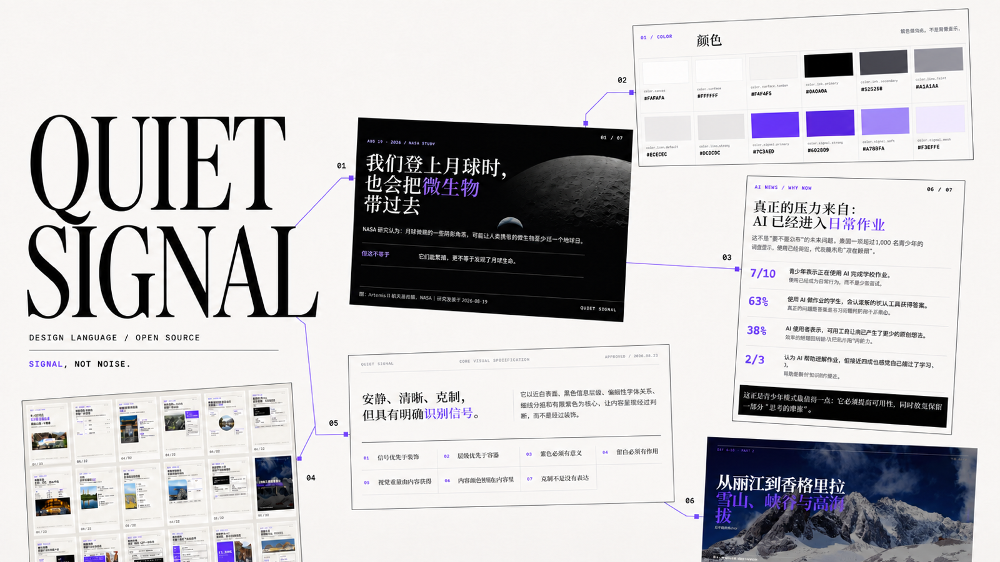
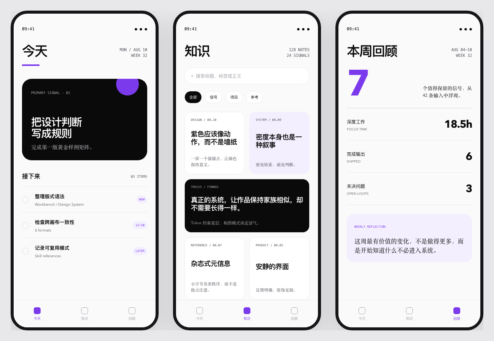
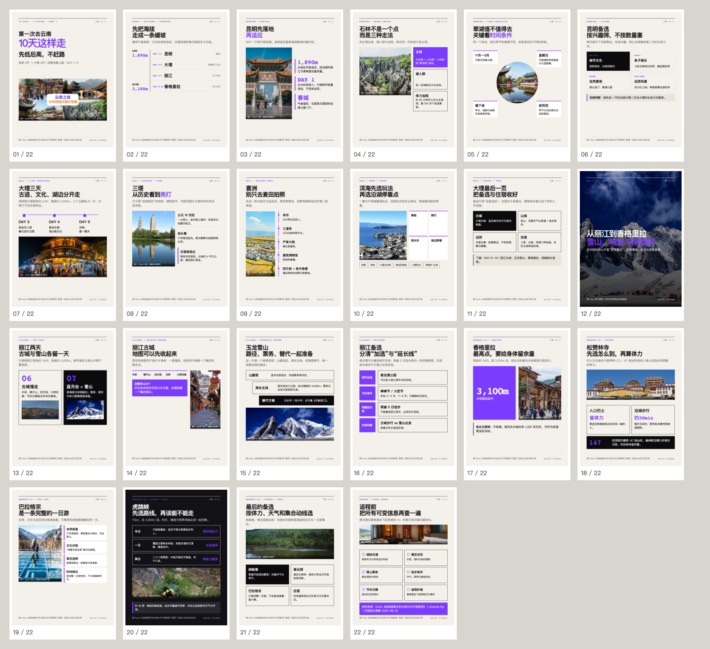
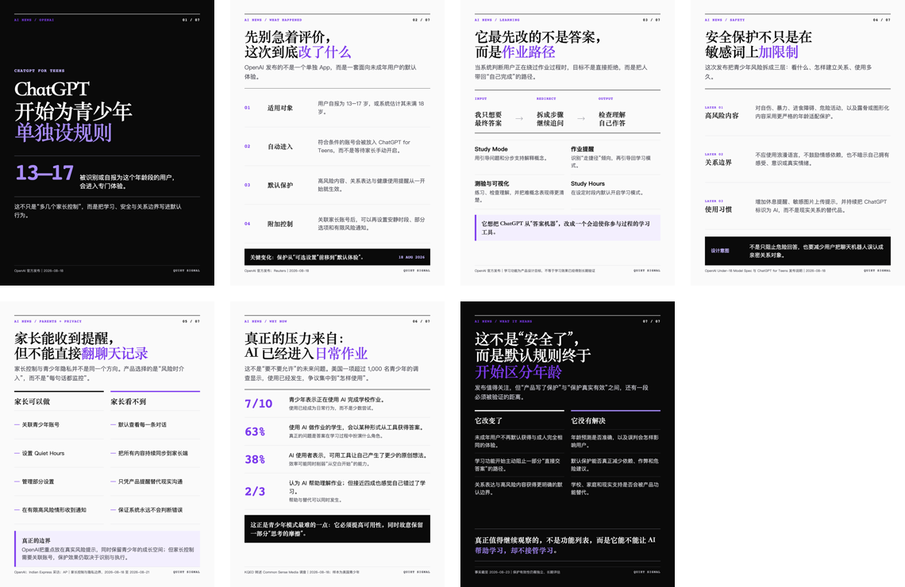
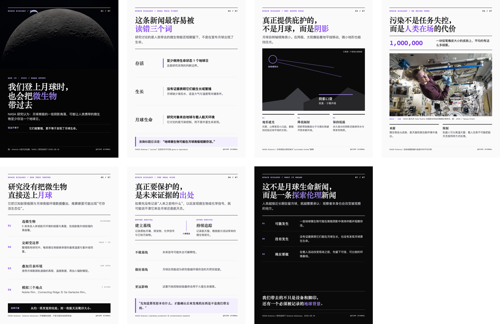
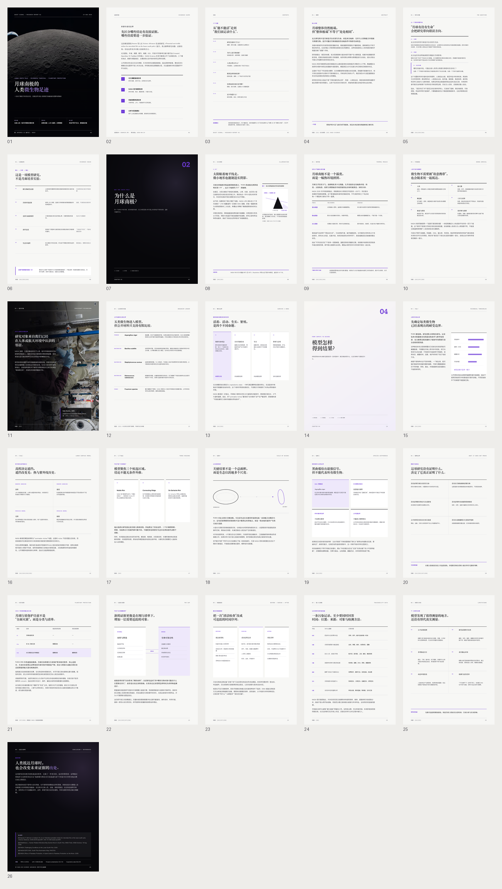

<div align="center">

# Quiet Signal

面向 AI 设计工作的开源视觉语言与生产型 Skill 集合。

[](LICENSE)

[](https://skills.sh/docs/cli)

</div>



Quiet Signal 用近白表面、清晰的黑灰层级、编辑性字体关系、细线分组和有限的紫色信号，帮助 AI Agent 产出安静、清楚、克制，但具有明确辨识度的设计结果。

它不是一套固定模板。基座 Skill 定义跨媒介稳定的视觉身份；小红书与长篇报告 Skill 在此基础上补充各自媒介的内容组织、实现、渲染与验收规则。

## 包含的 Skills

| Skill | 用途 | 适合场景 | 依赖 |
| --- | --- | --- | --- |
| [`quiet-signal-design`](skills/quiet-signal-design/) | 应用或审核 Quiet Signal 核心视觉语言 | 界面、网站、海报、社交图、演示文稿等已明确的设计任务 | 无 |
| [`quiet-signal-xhs`](skills/quiet-signal-xhs/) | 生成、修改、渲染与审核 1080×1440 小红书图文 | 文章、文字、URL 或用户已规划的图文内容 | `quiet-signal-design` |
| [`quiet-signal-reports`](skills/quiet-signal-reports/) | 制作可编辑 HTML/CSS、A4 PDF 与全页 QA 图 | 需要完整论证、来源与长篇阅读的报告 | `quiet-signal-design` |

## 如何安装

按需要选择下面的能力，把对应命令复制到终端运行。小红书和报告 Skill 依赖基座，因此安装时会一起加入 `quiet-signal-design`。

### 基座：视觉设计与审核

```bash
npx skills add oyorf/quiet-signal --skill quiet-signal-design
```

### 小红书图文

```bash
npx skills add oyorf/quiet-signal \
  --skill quiet-signal-design \
  --skill quiet-signal-xhs
```

### 长篇报告

```bash
npx skills add oyorf/quiet-signal \
  --skill quiet-signal-design \
  --skill quiet-signal-reports
```

安装完成后，复制下面对应的中文指令，粘贴到你的 Agent 工具中，再补充自己的内容或文件即可使用。

## 1. 基座：`quiet-signal-design`

基座保存 Quiet Signal 的核心视觉身份，包括颜色、字体角色、空间关系、几何、表面、图像、动效与验收边界。它有两种使用方式：

- **应用**：把视觉语言应用到一个目标、内容、结构和输出要求已经明确的设计任务。
- **审核**：对现有作品进行审查，指出符合项、具体违反项与最小修正建议。

### 用法

```text
使用 quiet-signal-design Skill，帮我设计一个内容策划工作台。
保留素材库、选题列表、内容编辑区和发布状态四项核心功能，
应用 Quiet Signal 视觉语言，输出完整的桌面端界面和可编辑源文件。
```

```text
使用 quiet-signal-design Skill，帮我设计一款个人任务与知识管理 App。
需要包含“今天”“知识”“本周回顾”三个核心页面，清楚呈现任务、笔记和每周数据，
应用 Quiet Signal 视觉语言，输出完整的移动端界面和可编辑源文件。
```

为了得到稳定结果，请同时提供：设计对象与目标、必须保留的内容、必要结构或功能、尺寸与技术限制，以及期望的交付格式。基座只定义“如何看起来”，不会替用户发明内容策略、产品功能或媒介规格。

### 示例

下面的个人任务与知识管理 App 由基座视觉语言组织：三个核心页面分别承载当日行动、知识检索与每周回顾，紫色只用于当前状态和关键数据，界面通过层级、细线与空间建立清晰阅读路径。



核心规范见 [`skills/quiet-signal-design/references/SPEC.md`](skills/quiet-signal-design/references/SPEC.md)。

## 2. 小红书：`quiet-signal-xhs`

`quiet-signal-xhs` 把中文文字、文章、URL 或用户指定的页面计划制作成 1080×1440（3:4）图文系列。它会完成必要的内容理解与分页、可编辑实现、逐页渲染和最终视觉 QA，同时保留事实、限定条件、来源和用户已经锁定的文案。

### 用法

```text
使用 quiet-signal-xhs Skill，把下面这篇文章制作成一组 1080×1440 的小红书图文。
保留所有事实、限定条件和来源，交付可编辑源文件、每一页 PNG 和整组总览图。
文章内容：
```

如果页数、顺序或某页文案已经确定，请直接在提示中写明；Skill 会保留这些决定，只处理尚未锁定的部分。

### 示例：云南旅行

22 页旅行图文同时使用路线、时间线、比较、清单和目的地图片页。变化来自内容关系，统一感来自稳定的字体、颜色、边距、来源与页码系统。



### 更多小红书示例

纯文字内容不依赖装饰图片，也可以通过层级、编号、细线和有限信号色形成完整阅读路径。



科学内容则用真实图片承担现场或证据角色，并明确区分事实、推测与限制。



媒介规范、演示索引与可运行源码位于 [`skills/quiet-signal-xhs/references/`](skills/quiet-signal-xhs/references/)。演示是视觉与生产证据，不是固定模板。

## 3. 长篇报告：`quiet-signal-reports`

`quiet-signal-reports` 面向需要完整解释、证据边界和来源账本的长篇内容。可编辑 HTML/CSS 是排版源，A4 PDF 是正式交付物，逐页 PNG 与总览图是视觉验收证据。

### 用法

```text
使用 quiet-signal-reports Skill，把下面这些资料整理成一份有来源支撑的 A4 长篇报告。
保留完整论证、方法、证据边界和局限，交付可编辑 HTML/CSS、来源账本、
最终 PDF、逐页 PNG 和整份报告总览图。
资料内容：
```

### 示例：月球南极微生物长篇报告

该示例包含 26 页 A4 内容，展示连续正文、机制说明、证据照片、条件表、比较关系、底部补充层与来源系统如何在同一份报告中共存。



完整 HTML/CSS、来源账本与本地图片位于 [`skills/quiet-signal-reports/references/implementations/lunar-microbe-longform/`](skills/quiet-signal-reports/references/implementations/lunar-microbe-longform/)。

## 设计原则

- **信号优先于装饰**：每个醒目元素都应说明它在提示什么。
- **层级优先于容器**：先用字号、字重、对齐、邻近和空间组织信息。
- **紫色必须有语义**：紫色只用于品牌、焦点、选择和关键变化。
- **留白必须有作用**：留白用于暂停、聚焦、呼吸或转场。
- **面积服从内容重量**：不为填满画布制造空洞标题、卡片或图表。
- **可访问性不可让步**：不依赖颜色单独表达状态，优先保证清晰与可读。

Quiet Signal 不默认使用紫色渐变、玻璃拟态、装饰性 3D、层层圆角、卡片墙、假仪表盘或无意义循环动效。

## 仓库结构

```text
quiet-signal/
├── docs/assets/                    # README 与发布素材
├── skills/
│   ├── quiet-signal-design/        # 核心视觉语言与规范
│   ├── quiet-signal-xhs/           # 小红书生产、演示与完整实现
│   └── quiet-signal-reports/       # 长篇报告生产、渲染脚本与完整实现
├── LICENSE
└── README.md
```

每个 Skill 都包含其正常工作直接依赖的规范、参考实现和参考素材。外部测试输出、研究材料和未发布的内部开发文档不属于本仓库。

## 贡献

欢迎通过 Issue 报告问题、提出媒介适配建议，或通过 Pull Request 改进文档与实现。提交前请注意：

1. 不要把单次作品的局部构图直接升级为核心规则；
2. 新增或修改核心视觉规则时，说明语义、适用条件、禁止用法与版本影响；
3. 新增示例时保留来源和授权信息，不提交无权公开的图片或内容；
4. 修改小红书或报告实现后，重新渲染全部页面并检查总览与全尺寸结果。

## License

本项目采用 [MIT License](LICENSE)。

MIT License 适用于本仓库原创的代码与文档。演示中引用的新闻内容、商标与第三方图片仍归各自权利人所有；其来源和署名保留在对应实现与来源账本中，不因收录于本仓库而改变授权范围。
